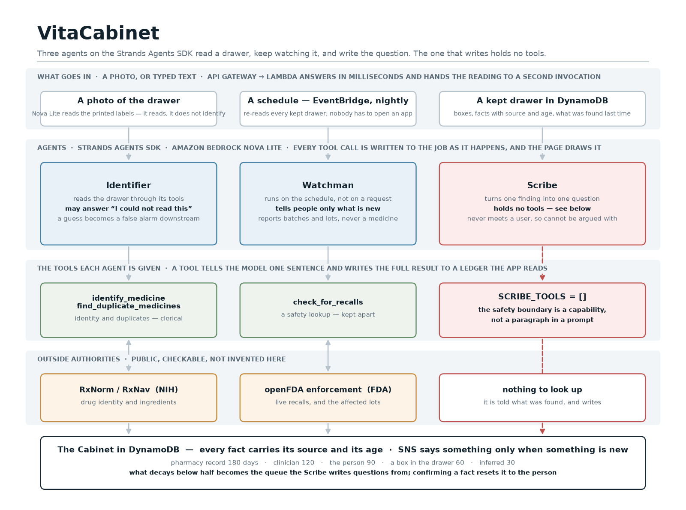

# VitaCabinet

**Photograph the medicine boxes in a drawer. Three agents read it, keep watching it,
and write down the question to ask a pharmacist. It never tells anyone what to take.**

**Live: https://b5emjsgbi1.execute-api.eu-north-1.amazonaws.com** · [a drawer the Watchman has already visited](https://b5emjsgbi1.execute-api.eu-north-1.amazonaws.com/?drawer=b2c20c522b)

Built for the AWS *Agents for Humans* hackathon (Everyday Agents track) with the
[Strands Agents SDK](https://strandsagents.com) on Amazon Bedrock.

---

## The problem, stated exactly

Ask anyone to name every medicine in their mother's drawer, with strengths. Almost
nobody can. The drawer is the real record, and it is a mess: a brand and its generic
side by side, something a cardiologist stopped last spring that nobody threw away, a
box from a batch that was recalled four months ago.

Every formal record of the same drawer is a photograph of a moment, presented as
though it were current. A GP's list is what was true in March. **Neither says so** —
and that unmarked confidence is the hazard, not the staleness. A clinician who knows
a list is six months old asks. One handed the same list with no date acts on it.

VitaCabinet is a record that admits what it does not know — and a small fleet of
agents that keep reducing what it is unsure about, in the background, for as long as
the drawer exists.

## Architecture



## What it does, in the order you see it

1. **Photograph the boxes.** Amazon Nova Lite reads the printed name and strength off
   each box. It *reads*; it does not identify. Identity comes next, from an outside
   authority, so every fact can say where it came from.
2. **The Identifier reads the drawer** — a Strands agent calling `identify_medicine`
   once per box against [RxNorm](https://lhncbc.nlm.nih.gov/RxNav/) (NIH), then
   `find_duplicate_medicines` across all of them. A box it cannot confirm is reported
   as unreadable, never guessed.
3. **The Watchman checks the safety record** — a second agent calling
   `check_for_recalls` once per ingredient against
   [openFDA enforcement](https://open.fda.gov/apis/drug/enforcement/), live recalls
   only, lot numbers carried, combination products flagged.
4. **You watch them work.** Every tool call is written to the job as it happens and
   the page draws the trace while the agents are still running — tool, argument,
   what the tool said back, how long it took.
5. **Keep the drawer.** Facts go to DynamoDB carrying their source and age. A box in a
   drawer is believed for 60 days; a pharmacy dispensing record for 180. Confirming a
   fact moves it to the person and resets it.
6. **It keeps watching.** EventBridge runs the Watchman nightly over every kept
   drawer. SNS emails only when something is *new* — by finding, not by count.
7. **The Scribe writes the question.** One plain sentence per finding, for a
   pharmacist. It holds no tools.

## The two ideas worth stealing

### Confidence is stored, not assumed

Nothing is a bare fact ([`app/cabinet.py`](app/cabinet.py)). Every entry carries where
it came from and when it was last confirmed, and answers how much it should still be
believed — a straight line to zero over a horizon that depends on the source:

| Source | Believed for |
| --- | --- |
| a pharmacy dispensing record | 180 days |
| a clinician's list | 120 days |
| the person themselves | 90 days |
| a box photographed in the drawer | 60 days |
| inferred from other facts | 30 days |

Two sources disagreeing caps confidence low however fresh the fact. What falls out is
a **queue** — things worth one question each, least believable first — which is a
shape a background agent can work through for years.

### The safety boundary is a capability, not a paragraph

Three agents, split along lines that actually matter ([`app/agents/fleet.py`](app/agents/fleet.py)):

| Agent | Why it is separate | Tools it holds |
| --- | --- | --- |
| **Identifier** | its truth comes from an outside authority, and it must be able to say "I could not read this" | `identify_medicine`, `find_duplicate_medicines` |
| **Watchman** | runs on a schedule, not in a request — recalls arrive when they arrive | `check_for_recalls` |
| **Scribe** | writes to a human, so it must never form a medical opinion | **none** |

An agent that can look up whether a drug is dangerous will eventually write the
answer down as advice, however firmly its prompt says otherwise. So the Scribe is not
given the lookup. The rule is a one-line assertion, not a policy:

```python
def test_the_scribe_holds_no_tools_at_all():
    assert tools.SCRIBE_TOOLS == []
```

## How the agents are wired (the part that is easy to get wrong)

**Tools tell the model one sentence and write the full result to a ledger.** The first
version returned the whole openFDA payload to the model; thirteen live recalls of
amlodipine blew straight through Nova's output budget. Now `check_for_recalls`
returns *"metformin: 23 live recalls, 4 of them combination products, newest…"* to
the model and the structured records to a per-reading ledger the app assembles
findings from ([`app/agents/tools.py`](app/agents/tools.py)). The model orchestrates;
the data never passes through it.

**Findings come from the ledger, never from the model's prose.** Nova once rewrote
`Glucophage 500mg` into `metformin hydrochloride 500 mg` before passing the boxes
back to `find_duplicate_medicines`, and the one pair this project exists to find
collapsed into a single entry. Duplicates are now recomputed from the ledger after
the agent finishes, regardless of what it passed.

**A reading is a job.** API Gateway gives a request thirty seconds and two agents want
more, so `POST /scan` writes the boxes to DynamoDB, invokes the same Lambda
asynchronously, and answers at once with an id. A Strands hook writes each tool call
to the job as it happens; the page polls and draws it ([`app/agents/run.py`](app/agents/run.py)).

## Running it

```bash
python3 -m venv .venv && source .venv/bin/activate
pip install -r requirements.txt
pytest -q          # against the LIVE NIH, openFDA and Bedrock — see below
uvicorn app.api:app --port 8080
```

The tests call RxNav, openFDA and Bedrock for real. Every interesting failure in this
project was a real-data failure — nonsense scoring above a real drug, a terminated
recall looking exactly like a live one, a model rewriting its own tool arguments — and
a mock would have passed every one of them. A suite that passes against a recorded
response proves the recording, not the claim.

Bedrock access in `eu-north-1` is needed for the agents; locally the store is an
in-memory dictionary and the job runs on a thread — same code, same interface.

```bash
python scripts/deploy.py       # Lambda + API Gateway + DynamoDB + EventBridge + SNS, idempotent
```

## What it talks to

- **Strands Agents SDK** — the three agents, their tools, the hook that records the trace
- **Amazon Bedrock** — Nova Lite, for the agents and for reading photographed labels
- **AWS Lambda + API Gateway** — the app; a reading runs as an asynchronous invocation
- **Amazon DynamoDB** — jobs (with TTL) and kept drawers
- **Amazon EventBridge** — the nightly Watchman
- **Amazon SNS** — email, only when something is new
- **RxNorm / RxNav** (NIH) and **openFDA** (FDA) — the outside authorities

## Recording the demo

`/director` is a teleprompter that drives the app over a BroadcastChannel so the
recording is one unedited take — see [`docs/RECORD-NOW.md`](docs/RECORD-NOW.md).

## The build journey, on builder.aws

- [I gave one of my agents no tools at all](https://builder.aws.com/content/3IgYR6LSK8Egmfr1jFBDELaleu3/agents-for-humans-i-gave-one-of-my-agents-no-tools-at-all)
- [The model orchestrates, the data never passes through it](https://builder.aws.com/content/3ImUOrZqGJiKgBTZHzHFlAR6H0M/agents-for-humans-the-model-orchestrates-the-data-never-passes-through-it)
- [A medical record that admits what it does not know](https://builder.aws.com/content/3ImVQlXXdImOk9KJCErIpgwbgw9/agents-for-humans-a-medical-record-that-admits-what-it-does-not-know)

## This is not medical advice

VitaCabinet does not tell anyone what to take, what to stop, or what to throw away.
It finds what is uncertain in a drawer, keeps watching it, and writes down the
question to ask a pharmacist. That limit is enforced by which agent holds which tool,
and it is tested.

---

Built by Tahsin Bayraktar · Vitamedas Inc. · info@gravitilabs.com · Apache 2.0
